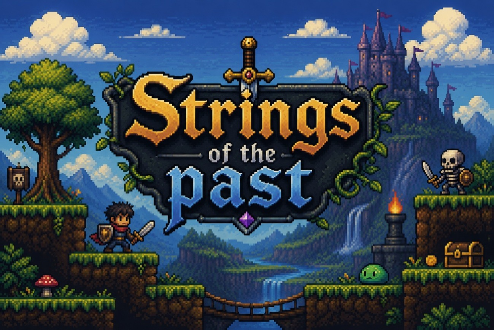
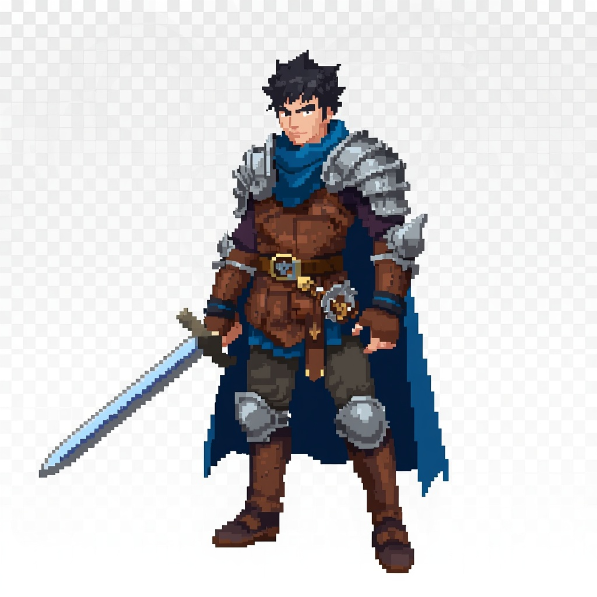
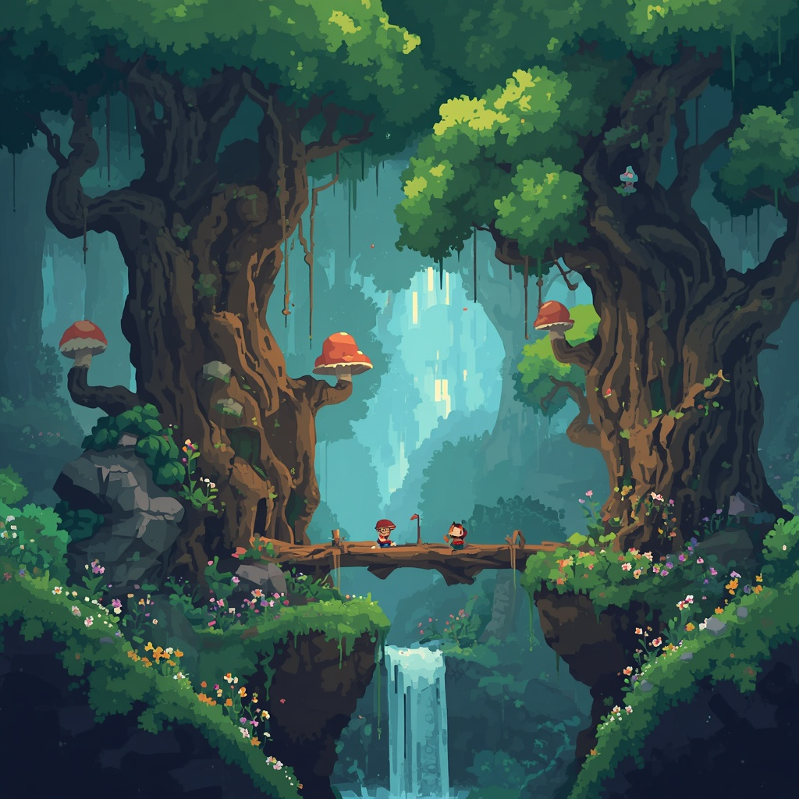
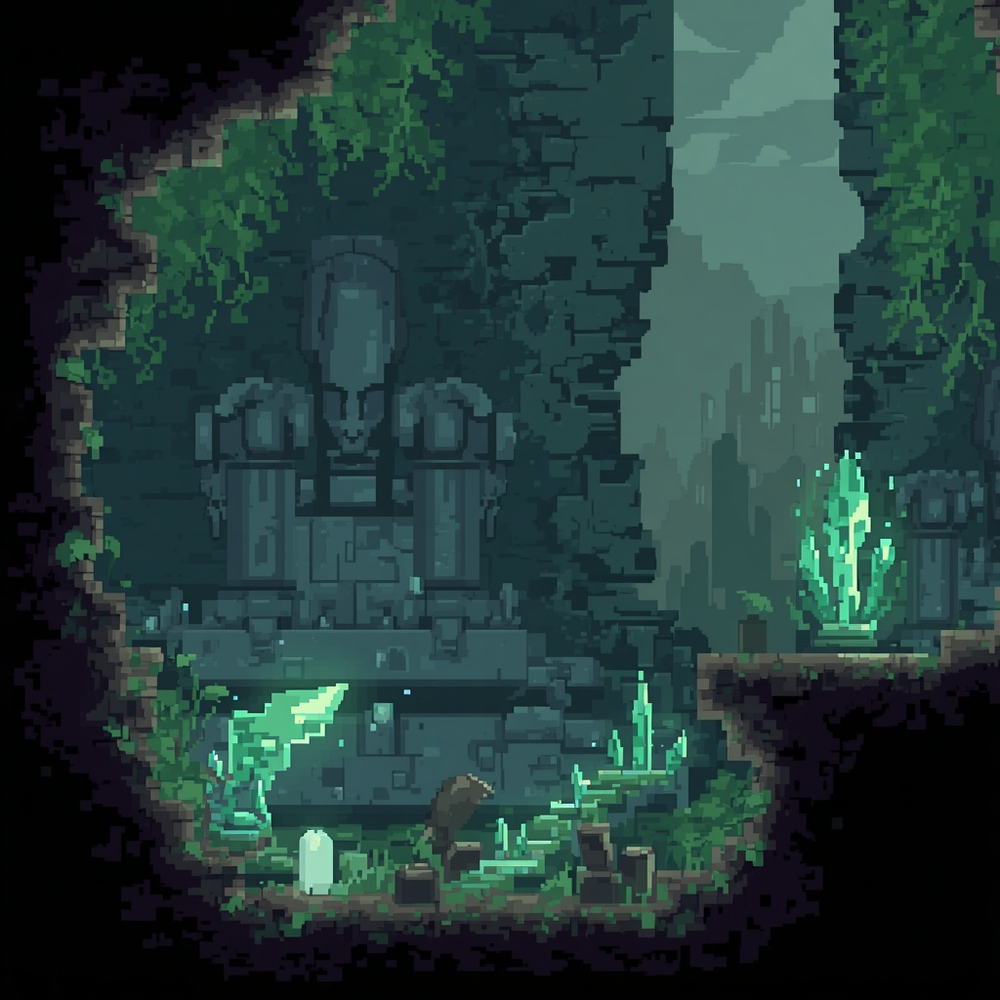
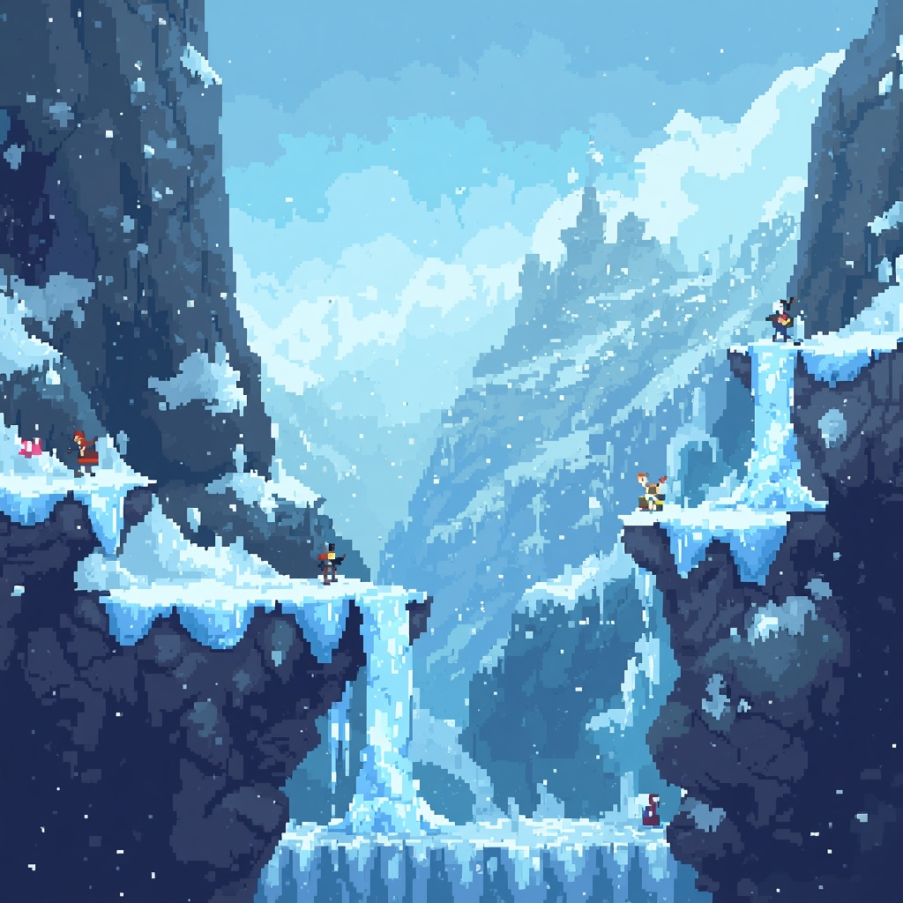
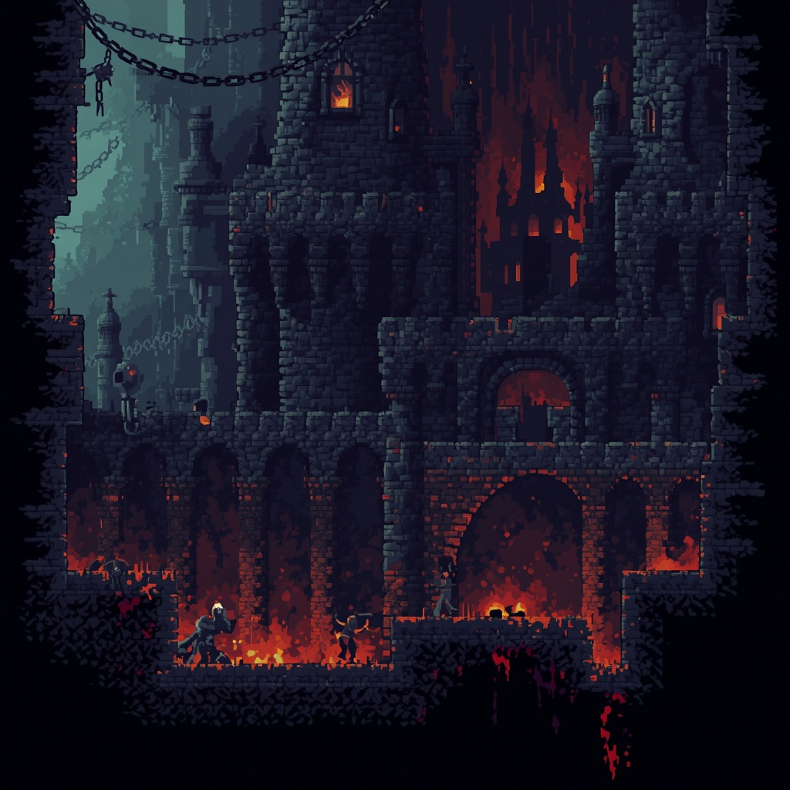
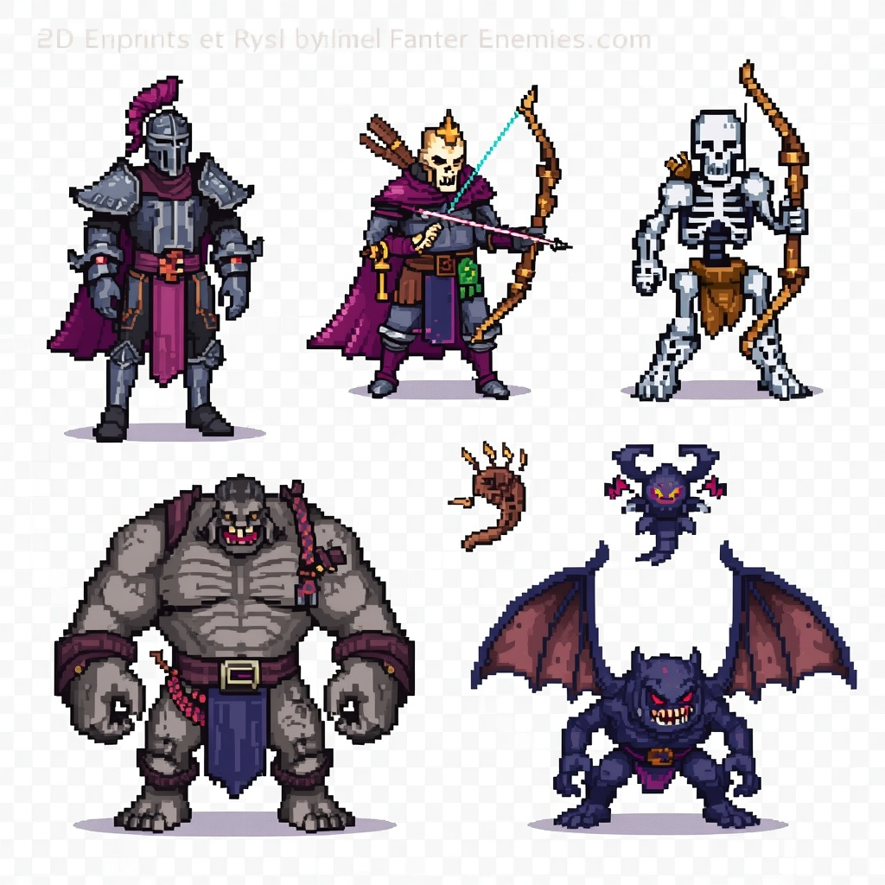
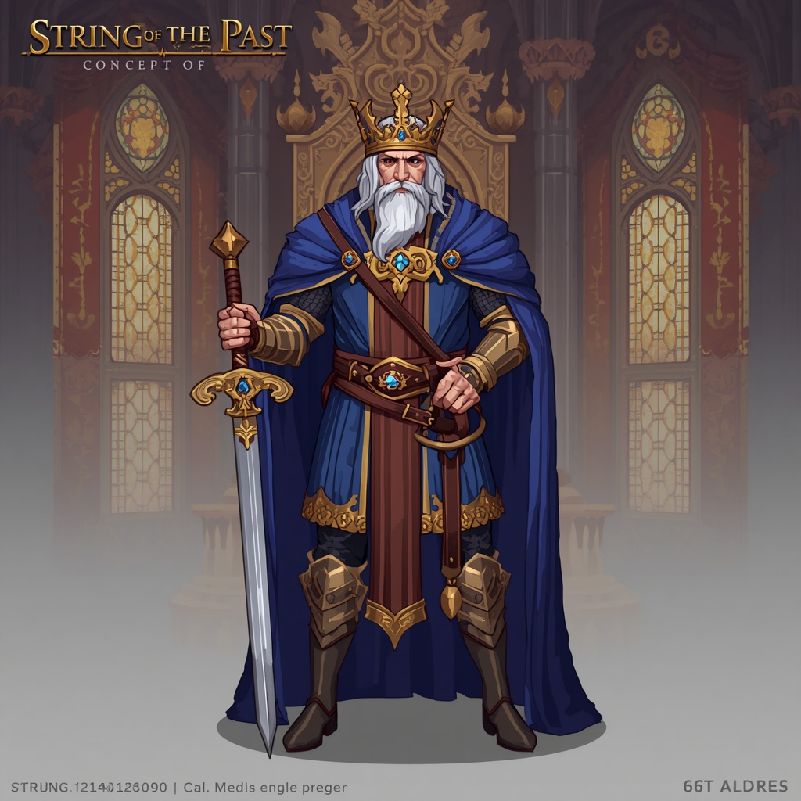
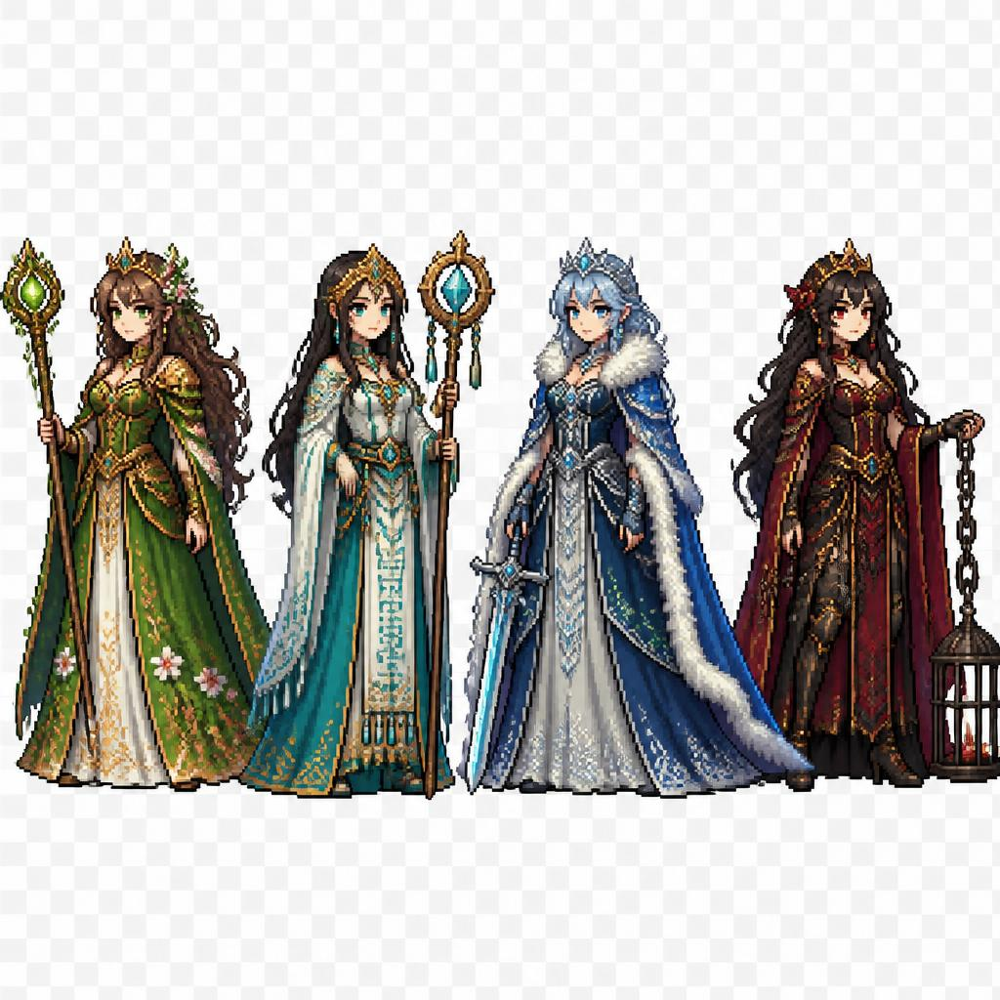

# Game Design Document

# Strings of the Past
<p align="center">
  
</p>

> **Versión:** 1.0  
> **Autor:** Federico Javier Alfaro  
> **Materia:** Diseño de Videojuegos II  
> **Carrera:** Tecnicatura en Diseño y Programación de Videojuegos  
> **Universidad Nacional del Litoral**

---

## Índice

1. [Introducción](#1-introducción)
2. [Gameplay y Mecánicas](#2-gameplay-y-mecánicas)
3. [Arte](#3-arte)
4. [Historia](#4-historia)
5. [Descripción de una Sesión de Juego](#5-descripción-de-una-sesión-de-juego)
6. [Música](#6-música)
7. [Controles](#7-controles)

---

# 1. Introducción

## 1.1 Descripción General

**Strings of the Past** es un videojuego de acción, aventura y plataformas en dos dimensiones desarrollado en **Unity**, ambientado en un reino medieval de fantasía que ha sido consumido por una antigua oscuridad.

El jugador controlará a un joven guerrero que emprende una peligrosa travesía para rescatar a las princesas capturadas por criaturas surgidas de antiguas ruinas y descubrir el origen de la corrupción que amenaza con destruir el reino.

A lo largo de la aventura el jugador recorrerá distintos escenarios repletos de enemigos, trampas, secretos y caminos alternativos. Durante la exploración podrá obtener nuevas armas, reliquias, pociones y otros objetos que le permitirán acceder a nuevas zonas y enfrentar enemigos cada vez más poderosos.

El progreso estará basado en la exploración, el combate y la mejora constante del personaje mediante un sistema de experiencia, equipamiento e inventario. Cada región culminará con el rescate de una princesa, permitiendo avanzar en la historia y desbloquear nuevas áreas del mundo.

---

## 1.2 Audiencia Objetivo

El juego está dirigido principalmente a jugadores de entre **12 y 35 años** que disfrutan de videojuegos de acción y exploración con un alto componente de progresión del personaje.

Está pensado para quienes buscan una experiencia desafiante, donde la exploración sea recompensada y el dominio de las mecánicas tenga un papel importante. Los jugadores interesados en descubrir secretos, mejorar equipamiento y enfrentar enemigos con distintos patrones de comportamiento encontrarán una experiencia atractiva y variada.

El proyecto está orientado inicialmente al mercado de **PC**, aunque su diseño permitirá adaptaciones futuras para otras plataformas.

---

## 1.3 Juegos de Referencia

- Hollow Knight
- Castlevania: Symphony of the Night
- Shovel Knight
- The Legend of Zelda
- Celeste
- Dead Cells

---

## 1.4 Puntos Clave de Venta

- **Exploración recompensada:** escenarios con caminos alternativos, secretos y cofres ocultos.
- **Combate dinámico:** variedad de armas con estadísticas y habilidades propias.
- **Sistema de progresión:** experiencia, mejoras y equipamiento para fortalecer al personaje.
- **Narrativa emotiva:** una aventura impulsada por la promesa realizada por el protagonista a su madre.
- **Diversidad de escenarios:** cada región ofrece enemigos, desafíos y ambientaciones únicas.

# 2. Gameplay y Mecánicas

El objetivo principal consiste en recorrer las distintas regiones del reino derrotando enemigos, resolviendo obstáculos y explorando cada escenario para encontrar objetos importantes que permitan continuar la aventura.

El jugador deberá administrar cuidadosamente sus recursos, mejorar su equipamiento y aprender el comportamiento de los enemigos para superar cada desafío.

La exploración tendrá un papel fundamental, ya que numerosos caminos secundarios esconderán cofres, reliquias y mejoras permanentes que facilitarán el progreso durante la aventura.

---

## 2.1 Gameplay Loop

```text
Inicio de la aventura
        │
        ▼
Exploración del escenario
        │
        ▼
Obtención de recursos
        │
        ▼
Mejora del personaje
        │
        ▼
Superación de desafíos
        │
        ▼
Rescate de la princesa
        │
        ▼
Acceso a una nueva región
```

---

## 2.2 Reglas Principales

- El jugador debe llegar al final de cada nivel para continuar la historia.
- Si la salud llega a cero, reaparecerá en el último **checkpoint** activado.
- Las armas encontradas permanecerán disponibles durante toda la partida.
- Algunas zonas solo podrán accederse utilizando objetos especiales obtenidos en regiones anteriores.
- Las pociones son consumibles y deben administrarse estratégicamente.
- La experiencia obtenida permite aumentar las estadísticas del personaje.
- Los cofres ocultos contienen recompensas especiales que facilitan el progreso.

---

## 2.3 Mecánica Principal

El jugador controlará a un joven guerrero que deberá atravesar diferentes regiones del reino enfrentándose a criaturas corrompidas mientras explora el escenario en busca de recursos, armas y objetos especiales.

El combate se desarrollará en tiempo real, combinando ataques cuerpo a cuerpo, esquivas y el uso estratégico de habilidades especiales otorgadas por determinadas armas.

Cada enemigo presentará patrones de ataque diferentes, por lo que el jugador deberá aprender sus comportamientos para derrotarlos con éxito.

La exploración será uno de los pilares del juego. Cada escenario ofrecerá múltiples caminos, zonas ocultas y recompensas opcionales que incentivarán al jugador a recorrer completamente cada nivel antes de continuar con la historia principal.

---

## 2.4 Mecánicas Generales

- **Exploración del entorno:** búsqueda de caminos alternativos, habitaciones secretas y cofres ocultos.

- **Combate cuerpo a cuerpo:** utilización de distintas armas con estadísticas y habilidades propias.

- **Sistema de experiencia:** al derrotar enemigos y completar objetivos el personaje obtiene experiencia para mejorar sus atributos.

- **Inventario:** almacenamiento de armas, reliquias, llaves, pociones y otros objetos importantes.

- **Sistema de consumibles:** utilización de pociones que otorgan efectos temporales como recuperación de vida o aumento de daño.

- **Interacción con el entorno:** activación de mecanismos, apertura de puertas y resolución de pequeños desafíos ambientales.

- **Checkpoints:** puntos de control donde el progreso queda guardado automáticamente.

---

## 2.5 Personajes

### Protagonista

El protagonista es un joven guerrero que emprende su viaje motivado por la promesa realizada a su madre antes de su fallecimiento: proteger a quienes no puedan defenderse por sí mismos.

A medida que avanza en la aventura descubrirá nuevas habilidades, obtendrá armas más poderosas y comprenderá el verdadero origen de la oscuridad que amenaza al reino.

#### Habilidades

- Combate con espada.
- Esquiva.
- Ataque cargado.
- Uso de armas especiales.
- Interacción con reliquias antiguas.

---

### Rey Aldren

Gobernante del reino y uno de los pocos sobrevivientes de la antigua guerra. Será quien encomiende oficialmente la misión de rescatar a las princesas y recuperar las reliquias perdidas.

#### Habilidades

- Gran estratega.
- Amplio conocimiento sobre la historia del reino.
- Guía al protagonista durante la aventura.

---

### Princesas

Cada princesa representa una región del reino y, tras ser rescatada, aportará nueva información sobre la historia, desbloqueará mejoras o permitirá acceder a nuevas áreas.

Aunque todas comparten el objetivo de recuperar la paz, cada una posee una personalidad y conocimientos diferentes que enriquecen la narrativa.

---

## 2.6 Enemigos

| Enemigo | Características |
|----------|-----------------|
| Soldado Corrompido | Combate cuerpo a cuerpo, defensa media y ataques equilibrados. |
| Criatura de las Ruinas | Muy rápida, baja resistencia y ataques en grupo. |
| Arquero Maldito | Especialista en ataques a distancia. |
| Guardián Antiguo | Gran cantidad de vida y ataques de alto daño. |
| Jefes | Varias fases de combate y mecánicas exclusivas. |

---

## 2.7 Objetos Importantes

### Armas

El jugador podrá encontrar diferentes armas distribuidas a lo largo de la aventura.

Cada una modificará aspectos como:

- Daño.
- Velocidad de ataque.
- Alcance.
- Habilidades especiales.

Algunas armas podrán alterar el escenario. Por ejemplo, una espada mágica permitirá crear plataformas temporales para acceder a zonas inaccesibles.

---

### Consumibles

- Poción de vida.
- Poción de fuerza.
- Poción de velocidad.
- Poción de resistencia.
- Alimentos para recuperar salud.

---

### Objetos Clave

- Llaves antiguas.
- Reliquias sagradas.
- Fragmentos mágicos.
- Gemas.
- Pergaminos.
- Monedas del reino.

# 3. Arte

## Estilo Visual

**Strings of the Past** presenta una estética **Pixel Art 2D** inspirada en los clásicos videojuegos de acción y plataformas. La dirección artística combina escenarios coloridos con ambientes oscuros y misteriosos para transmitir el contraste entre un reino que alguna vez fue próspero y la corrupción que lentamente lo consume.

Cada región contará con una paleta de colores propia que permitirá diferenciar visualmente los distintos biomas del juego. La iluminación y los efectos visuales ayudarán a destacar elementos interactivos, caminos ocultos y zonas importantes para la exploración.

El diseño de personajes buscará transmitir personalidad mediante animaciones fluidas y siluetas fácilmente reconocibles. Del mismo modo, los enemigos presentarán características visuales que permitan al jugador identificar rápidamente su comportamiento antes del combate.

---

## Protagonista

<p align="center">
    
</p>

<p align="center">
<i>Figura 3.1 – Concept Art del protagonista.</i>
</p>

---

## Bosque Encantado

<p align="center">
    
</p>

<p align="center">
<i>Figura 3.2 – Bosque Encantado.</i>
</p>

---

## Ruinas Antiguas

<p align="center">
    
</p>

<p align="center">
<i>Figura 3.3 – Ruinas Antiguas.</i>
</p>

---

## Montañas Heladas

<p align="center">
    
</p>

<p align="center">
<i>Figura 3.4 – Montañas Heladas.</i>
</p>

---

## Castillo Oscuro

<p align="center">
    
</p>

<p align="center">
<i>Figura 3.5 – Castillo Oscuro.</i>
</p>

---

## Enemigos

<p align="center">
    
</p>

<p align="center">
<i>Figura 3.6 – Diseño conceptual de los enemigos.</i>
</p>

---

## Rey Aldren

<p align="center">
    
</p>

<p align="center">
<i>Figura 3.7 – Rey Aldren.</i>
</p>

---

## Princesas

<p align="center">
    
</p>

<p align="center">
<i>Figura 3.8 – Princesas del reino.</i>
</p>

---

> **Nota:** Las imágenes incluidas en esta sección fueron generadas mediante herramientas de inteligencia artificial y se utilizan únicamente como referencia visual para representar la dirección artística, la ambientación y el estilo general del proyecto. No corresponden al resultado final del videojuego y podrán modificarse durante el proceso de desarrollo.

# 4. Historia
Muchos años atrás, el reino vivía una época de prosperidad hasta que una guerra provocó la caída de gran parte de sus ciudades. Durante aquel conflicto, la madre del protagonista, una reconocida guardiana real, entregó su vida mientras protegía a numerosos inocentes de las fuerzas invasoras.

Antes de morir, le hizo prometer a su hijo que jamás permanecería indiferente ante el sufrimiento de quienes no pudieran defenderse por sí mismos.

Con el paso de los años, una antigua oscuridad comenzó a despertar bajo las ruinas olvidadas del reino. Extrañas criaturas surgieron desde las profundidades, corrompiendo bosques, fortalezas y aldeas enteras. En medio del caos, las princesas del reino fueron capturadas y encerradas en distintos castillos custodiados por poderosos guardianes.

Fiel a la promesa realizada durante su infancia, el protagonista emprende un peligroso viaje para rescatar a cada una de las princesas, enfrentar a los monstruos responsables de la invasión y descubrir el verdadero origen de la corrupción.

A medida que avanza en su aventura comprenderá que las criaturas no son el enemigo principal, sino el resultado de una fuerza ancestral que permanecía sellada desde hace siglos.
El destino del reino dependerá de su capacidad para superar cada desafío y mantener viva la promesa que dio sentido a toda su vida.

# 5. Descripcion de Sesión de juego
La partida comienza con el jugador llegando al Bosque Encantado, una de las primeras regiones del reino. Tras activar un antiguo altar que funciona como punto de control, el jugador explora distintos caminos mientras derrota soldados corrompidos y pequeñas criaturas surgidas de la oscuridad.

Durante la exploración encuentra un cofre oculto que contiene una nueva espada con mayor alcance y una poción de fuerza. Gracias a esta mejora logra acceder a una cueva secreta donde obtiene una reliquia necesaria para abrir la puerta del antiguo templo.

Dentro del templo aparecen nuevos enemigos con ataques a distancia que obligan al jugador a combinar esquivas y ataques precisos. Luego de superar varias trampas y plataformas móviles, el jugador llega hasta la cámara principal donde enfrenta una cantidad de enemigos.

Tras una intensa batalla todos los enemigos son derrotados. Como recompensa, el jugador obtiene una nueva habilidad permanente y desbloquea el acceso hacia las Ruinas Antiguas, donde continuará la historia principal.

Finalmente, el jugador puede guardar el progreso, revisar su inventario, mejorar sus estadísticas utilizando la experiencia obtenida y prepararse para la siguiente región.

# 6. Musica

## Musica de fondo
La banda sonora combinará composiciones orquestales con elementos de música ambiental para reforzar el tono épico y melancólico de la aventura.

Cada escenario contará con una identidad musical propia que acompañará la exploración y el combate sin perder la coherencia con la ambientación medieval fantástica.

#### Ejemplos de referencia

- **Ori and the Blind Forest OST:** Se utilizará como referencia para las zonas de exploración debido a su estilo emocional y ambiental. 
- **Hollow Knight OST:** Inspirará las melodías presentes en cuevas, ruinas y enfrentamientos contra jefes. 
- **The Legend of Zelda OST:** Servirá como referencia para momentos de exploración y descubrimiento. 
- **Octopath Traveler OST:** Inspirará los combates importantes y escenas narrativas.

#### SFX (Efectos de sonido)
Los efectos de sonido buscarán transmitir impacto y reforzar las acciones del jugador 

- Golpes de espada con diferentes intensidades según el arma utilizada.
- Sonidos diferenciados para cada tipo de enemigo.
- Apertura de cofres.
- Activación de mecanismos.
- Consumo de pociones.
- Recolección de monedas y reliquias.
- Ambiente dinámico con viento, agua, aves y criaturas según la región. 

Durante los enfrentamientos contra jefes la música aumentará progresivamente su intensidad para generar una mayor sensación de tensión.

# 7. Controles

| Teclado | Joystick |
|----------|-----------------|
| **A/D** – Movimiento  | **Stick Izquierdo** - Movimiento |
| **Espacio** – Saltar | **Botón A** - Saltar |
| **Click Izquierdo** – Ataque principal  | **Botón X** – Ataque principal |
| **Click Derecho** – Ataque secundario  | **Botón Y** – Ataque secundario  |
| **Shift** – Esquivar | **Botón B** - Esquivar |
| **E** – Interactuar   | **Botón RB** – Interactuar |
| **Q** – Consumir consumible  | **Botón LB** – Activar consumible |
| **I** – Inventario   | **Botón View** – Inventario |
| **Esc** – Pausa  | **Botón Start** – Pausa |
| **1** – Habilidad especial 1   | **Boton RT** – Habilidad especial 1 |
| **2** – Habilidad especial 2  | **Botón LT** – Habilidad especial 2 |
